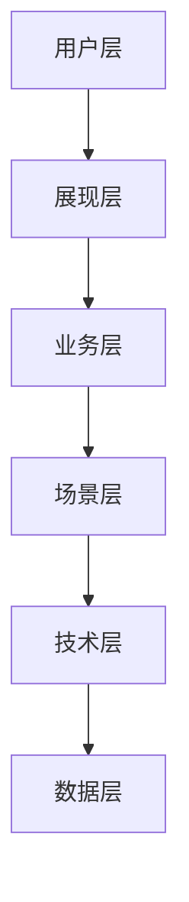

# LaborAid 架构图 — 参考与 Prompt 模板

## Excalidraw 生成 Prompt（复制给 AI）

```
为「劳权智助 LaborAid」生成 Excalidraw 架构图 JSON：
- 风格：深蓝背景 #0a1628，cyan 边框 #00d4ff，白色文字，科技风
- 内容：六层架构（用户层/展现层/业务层/场景层/技术层/数据层）
- 每层 3～5 个要点，层与层之间用向下箭头
- 右侧摘要框：六层结构 · 三种用户 · 四大场景 · 五项关键算法
- 输出可导入 excalidraw.com 的 .excalidraw 文件
```

## LEAP 算法页 Prompt

```
流程图：左侧「自然语言/结构化 Intake」→ STDE 案情抽取 → 案由匹配+证据清单
→ Supervisor Agent → 右侧分支五个 Specialist（Guidance/Evidence/Docgen/Research/Records）
→ 底部输出 next-step + pipeline_tasks。标注算法名 LEAP。
```

## Mermaid 常用片段

### 六层（横向简版）



## 导出命令

```powershell
# 仓库根目录
.\scripts\export-diagrams.ps1

# 或手动
npx -y @mermaid-js/mermaid-cli -i docs/diagrams/six-layer-architecture.mmd -o docs/diagrams/export/six-layer.png -b transparent
d2 docs/diagrams/six-layer-architecture.d2 docs/diagrams/export/six-layer.svg
```

## 外部 Skill 安装（可选）

```bash
gh skills install github/awesome-copilot excalidraw-diagram-generator
gh skills install github/awesome-copilot draw-io-diagram-generator
gh skills install github/awesome-copilot architecture-blueprint-generator
```

安装后与本项目 skill 联用：逻辑以 `docs/diagrams/` 为准，Excalidraw 负责美化。
