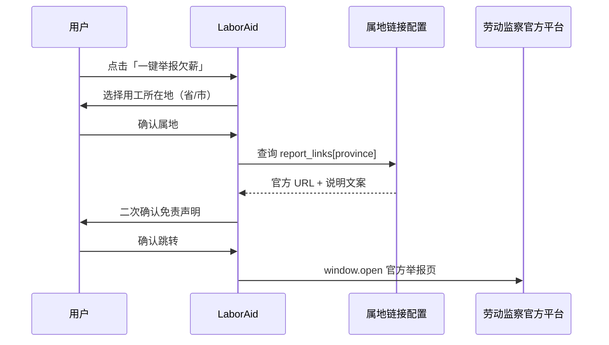
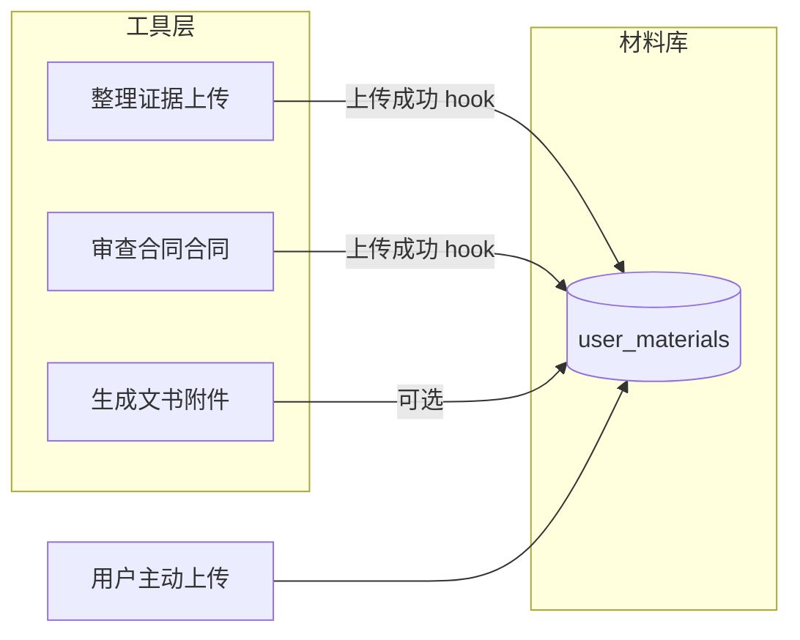

# 特定群体维权专区通道 & 个人材料库 — 设计方案

> **版本**：v1.0  
> **状态**：**已落地 v1**（专项通道页面 + 一键举报弹层 + 材料库 API/页面；整理证据上传自动归档）  
> **关联**：[产品架构](../../docs/product-architecture.md) · [维权指引配置](../frontend/src/config/labor/guidance.json) · [专项通道配置](../frontend/src/config/labor/special-channels.json)

---

## 1. 设计目标

| 目标 | 说明 |
|------|------|
| **社会责任感** | 为农民工、实习生/试用期、女职工等群体提供可识别的「专属入口」，体现产品公益导向，利于答辩与评审 |
| **办事可及** | 聚合欠薪举报、法援申请、快速立案指路，减少劳动者「不知道找谁」的焦虑 |
| **长期维权** | 维权周期可能数月，需 **按账号持久保存** 历史上传材料，避免换设备或隔月续办时重复整理 |
| **边界清晰** | 站内不替代政府立案系统；「一键举报」为 **跳转属地官方平台**，不做站内受理 |

---

## 2. 信息架构（服务层扩展）

在现有 **服务首页 → 维权指引 → 我的记录** 之上，增加 **维权专区通道** 子域：

```
服务首页 (/)
    │
    ├── 维权专区通道 (/channels)          ← 新增：群体入口总览
    │       ├── 农民工维权 (/channels/migrant-worker)
    │       ├── 实习生·试用期 (/channels/intern-probation)
    │       └── 女职工维权 (/channels/female-worker)
    │
    ├── 维权指引 (/guidance)              ← 已有：通用案由步骤
    ├── 我的记录 (/records)               ← 已有：统计聚合
    └── 我的材料 (/vault)               ← 新增：跨模块文件归档
```

**侧栏建议**（`agents.ts` 服务分组下）：

| 名称 | 路由 | 优先级 |
|------|------|--------|
| 维权专区 | `/channels` | P1 |
| 我的材料 | `/vault` | P1.5 |

---

## 3. 特定群体维权专区通道（P1）

### 3.1 三大专区内容结构（配置驱动）

每个专区采用统一 **页面模板**，内容由 `frontend/src/config/labor/special-channels.json` 驱动，便于答辩时改文案、不加后端发布流程。

| 区块 | 作用 |
|------|------|
| **专区标题 + 适用说明** | 一句话界定「谁适合用」 |
| **权利义务速览** | 3～5 条要点（实习生专区重点） |
| **推荐维权路径** | 步骤条（内链工具 / 外链官方） |
| **快捷入口** | 快速立案指路、举报电话、法援指南 |
| **一键举报** | 见 3.3 |
| **相关法条** | 外链国家法律法规数据库检索词 |
| **免责声明** | 与全站一致 |

### 3.2 各专区要点（评审话术）

#### A. 农民工维权专区 `migrant-worker`

| 模块 | 内容要点 |
|------|----------|
| 快速立案通道 | 说明劳动仲裁 / 监察投诉适用情形；外链 **属地** 仲裁委、人社办事入口（非站内立案） |
| 欠薪举报电话汇总 | 12333、12348、属地监察投诉电话（配置表按省） |
| 法律援助申请指南 | 经济困难标准说明 + 外链中国法律服务网 / 当地司法局法援中心 |
| 材料准备 | 内链 **整理证据**（工资条、考勤、包工头欠条）、**生成文书**（仲裁申请书） |
| 演示亮点 | **一键举报欠薪** → 跳转省级人社监察举报入口 |

#### B. 实习生 / 试用期劳动者专区 `intern-probation`

| 模块 | 内容要点 |
|------|----------|
| 身份界定 | 在校生实习 vs 已毕业试用；是否建立劳动关系的风险提示 |
| 权利义务 | 报酬、工时、保险、解除条件（配置化条目） |
| 常见争议 | 试用期违法解除、实习协议违约、未缴社保 |
| 工具联动 | 合同审查（审查合同）、证据上传（整理证据）、法条检索（检索法规） |

#### C. 女职工维权专区 `female-worker`

| 模块 | 内容要点 |
|------|----------|
| 三期保护 | 孕期、产期、哺乳期特殊保护要点 |
| 典型场景 | 调岗降薪、违法解除、产假工资、哺乳时间 |
| 举报与投诉 | 可向劳动监察、工会、妇联等反映（外链说明） |
| 材料建议 | 劳动合同、生育证明、工资流水、沟通记录 |

### 3.3 「一键举报」交互设计（演示加分）

> **原则**：不在站内收集举报表单（避免数据合规与责任），仅 **深度链接** 到官方平台。



| 步骤 | UI |
|------|-----|
| 1 | 按钮文案：`一键举报（跳转官方平台）` |
| 2 | 弹层：省市区选择（v1 可先 **省级**；演示用预填「示例省」） |
| 3 | 展示：「您即将离开 LaborAid，前往人力资源和社会保障部门官方渠道」 |
| 4 | 可选：复制举报电话 `12333` |
| 5 | 新窗口打开配置 URL |

**配置结构**（见 `special-channels.json` → `report_links`）：

```json
{
  "default": { "label": "全国人社服务", "url": "https://www.mohrss.gov.cn/" },
  "by_province": {
    "北京市": { "label": "北京市劳动监察举报", "url": "...", "phone": "12333" }
  }
}
```

> v1 演示：配置 3～5 个常用省市 + `default` 回退全国门户；后续可接民政部区划数据或高德 IP 粗定位（需隐私说明）。

### 3.4 前端页面（建议）

| 文件 | 说明 |
|------|------|
| `pages/channels/ChannelHub.tsx` | 三卡片入口 + 社会价值简述 |
| `pages/channels/ChannelDetail.tsx` | 读取 `channelId` 渲染模板 |
| `components/channels/ReportDialog.tsx` | 一键举报弹层 |
| `lib/api/channels.ts` | 可选 `GET /api/v1/channels` 返回 JSON（与静态文件二选一） |

**路由**：

```tsx
<Route path="channels" element={<ChannelHub />} />
<Route path="channels/:channelId" element={<ChannelDetail />} />
```

### 3.5 后端（P1 轻量）

| 方案 | 说明 |
|------|------|
| **推荐 v1** | 纯前端读 `special-channels.json`，零后端改动，答辩演示足够 |
| **可选** | `GET /api/v1/channels` 与 `GET /api/v1/channels/report-links?province=` 统一出口，便于运营后台改配置（P2） |

---

## 4. 个人材料库（P1.5 — 长期维权核心）

### 4.1 问题定义

当前文件分散在：

| 模块 | 存储路径 | 绑定关系 |
|------|----------|----------|
| 整理证据 | `uploads/evidence/{case_id}/` | 绑定 **案件**，非直接绑定用户 |
| 合同 | `uploads/contracts/` | 合同审查记录 |
| 知识库 | 知识库 API | 用户级 |
| 文书 | 多为生成文本 | DB 记录，附件可选 |

**痛点**：劳动者维权跨月进行，换手机或忘记关联案件时，难以找回「之前传过的工资条、聊天截图」。

### 4.2 产品定义

**我的材料**：面向 **登录用户** 的 **个人级** 文件归档空间，与维权阶段标签关联，可来自各工具自动归集或用户主动上传。

| 属性 | 说明 |
|------|------|
| 归属 | `user_id`（必须） |
| 可选关联 | `case_id`、`source`（evidence / contract / vault_manual / document_attachment） |
| 阶段标签 | `preparation` 准备 / `complaint` 投诉监察 / `arbitration` 仲裁 / `mediation` 调解 / `closed` 结案 |
| 生命周期 | 账号存续期间保留；注销账号按政策删除 |

### 4.3 数据模型（建议）

**表名**：`user_materials`

| 字段 | 类型 | 说明 |
|------|------|------|
| id | int PK | |
| user_id | int FK | 所有者 |
| case_id | int FK nullable | 关联案件（可选） |
| source | varchar(32) | `manual` / `evidence` / `contract` / `document` / `knowledge` |
| source_id | int nullable | 来源业务记录 id |
| title | varchar(500) | 显示名 |
| original_filename | varchar(500) | 原始文件名 |
| stored_path | varchar(500) | 相对 `UPLOAD_DIR` |
| mime_type | varchar(100) | |
| size_bytes | int | |
| stage | varchar(32) | 维权阶段标签 |
| tags | json nullable | 如 `["工资条","2024Q1"]` |
| note | text nullable | 用户备注 |
| sha256 | char(64) nullable | 可选去重 |
| created_at | datetime | |
| updated_at | datetime | |
| deleted_at | datetime nullable | 软删除 |

**索引**：`(user_id, created_at)`、`(user_id, stage)`、`(user_id, case_id)`

**存储路径**：

```
uploads/vault/{user_id}/{uuid}_{safe_filename}
```

### 4.4 API 设计

| 方法 | 路径 | 说明 |
|------|------|------|
| GET | `/api/v1/vault` | 分页列表；筛选 `stage`、`source`、`case_id`、`q` |
| POST | `/api/v1/vault/upload` | multipart 上传；返回材料元数据 |
| GET | `/api/v1/vault/{id}` | 详情 |
| GET | `/api/v1/vault/{id}/download` | 鉴权下载（Stream / 签名 URL） |
| PATCH | `/api/v1/vault/{id}` | 改 title、stage、tags、note、case_id |
| DELETE | `/api/v1/vault/{id}` | 软删除 |
| GET | `/api/v1/vault/stats` | 数量、总大小、按阶段分组（供首页/记录页展示） |

**权限**：所有接口 `get_current_user`，仅操作 `user_id == current_user.id`。

**配额（建议默认值，可配置）**：

| 项 | 默认 |
|----|------|
| 单文件大小 | 50 MB（与 `MAX_UPLOAD_SIZE_MB` 一致） |
| 用户总容量 | 500 MB（`VAULT_QUOTA_MB`） |
| 单用户文件数 | 500 |

### 4.5 与各模块联动（归集策略）



| 触发点 | 行为 |
|--------|------|
| 整理证据 `POST /evidence/upload` 成功 | 异步写入一条 `source=evidence` 的材料库副本（或仅存引用 + 同一文件路径，需统一路径策略） |
| 用户手动上传 | `source=manual` |
| 材料包导出 P2 | 从材料库勾选打包 ZIP |

**v1 实现建议**：先做 **独立上传 + 手动关联案件**；整理证据归集为 P1.5 第二步，避免重复占磁盘（可用硬链接或仅存 `source_id` 引用原 path）。

### 4.6 前端页面（`/vault`）

| 区域 | 功能 |
|------|------|
| 顶栏 | 已用容量 / 配额；上传按钮 |
| 筛选 | 维权阶段、来源、关联案件、关键词 |
| 列表/网格 | 文件名、阶段标签、上传时间、预览（图片/PDF） |
| 详情侧栏 | 备注编辑、下载、删除、关联案件 |
| 空状态 | 引导「从整理证据上传会自动归档」 |

**入口**：服务首页卡片、我的记录 Tab、专项通道「准备材料」步骤内链。

### 4.7 安全与合规

| 项 | 措施 |
|----|------|
| 鉴权 | 下载必须带 JWT；禁止猜测路径遍历 |
| 病毒扫描 | P2 可选 ClamAV |
| 隐私 | 材料库仅本人可见；管理员 **默认不可** 浏览用户材料（除非依法运维审计需求） |
| 加密 | P2 静态加密 at-rest |
| 留存 | 用户注销时级联删除或匿名化 |

---

## 5. 第三优先级（PPT 提及即可，v1 不开发）

| 功能 | 一句话方案 | 落地方式 |
|------|------------|----------|
| 律师 / 法援机构推荐 | 按地区展示外链律协、法援中心 | 配置 JSON + 卡片 |
| 维权成功案例社区 | UGC 论坛 | **不做**（见产品边界） |
| 企业违法信息查询 | 站内「查询企业」（企查查 736） | `/enterprise` |
| 劳动合同智能审查 | 已有 **审查合同** `/contracts` | PPT 写「已具备」 |
| 线上调解对接 | 跳转人民调解 / 仲裁委调解说明 | 外链 |

---

## 6. 实施路线图

| 阶段 | 内容 | 工作量（估） |
|------|------|----------------|
| **P1a** | `special-channels.json` + `/channels` 静态页 + 一键举报弹层 | 2～3 人日 |
| **P1b** | 服务首页 / 维权指引入口链到专项通道 | 0.5 人日 |
| **P1.5a** | `user_materials` 表 + CRUD API + `/vault` 页 | 4～5 人日 |
| **P1.5b** | 整理证据上传归集到材料库 | 1～2 人日 |
| **P2** | 省级举报链接运营配置、材料包 ZIP 导出、阶段时间线联动 | 按需 |

---

## 7. 答辩演示脚本（建议 2 分钟）

1. 服务首页 → **维权专区** → 进入 **农民工专区**  
2. 展示「欠薪举报电话」「法援申请指南」  
3. 点击 **一键举报** → 选择省份 → 跳转人社官方页面（提前打开备用标签）  
4. 切换 **女职工专区** → 三期保护要点  
5. 打开 **我的材料** → 展示上月上传的工资条仍在 → 「维权周期长，材料不丢失」  
6. PPT 翻页提及第三优先级外链能力，强调 **不做社区** 的合规考量  

---

## 8. 配置与代码落点一览

| 资产 | 路径 |
|------|------|
| 专项通道配置 | `frontend/src/config/labor/special-channels.json` |
| 通道页面（待建） | `frontend/src/pages/channels/` |
| 材料库模型（待建） | `backend/app/models/user_material.py` |
| 材料库路由（待建） | `backend/app/api/routers/vault.py` |
| 材料库页面（待建） | `frontend/src/pages/Vault.tsx` |

---

## 9. 与现有能力关系

| 已有 | 关系 |
|------|------|
| `/guidance` 通用案由 | 专项通道是 **横向人群维度**，指引是 **纵向案由维度**，互相链接 |
| `/records` | 材料库展示 **文件级** 历史；记录页展示 **业务对象级** 统计 |
| `/evidence` | 整理证据偏 **案件证据链分析**；材料库偏 **个人归档与长期留存** |
| 管理端 | 举报链接、通道文案可后续由管理员维护（P2） |

---

*文档结束 — 实施时以本方案为准，变更请递增版本号。*
