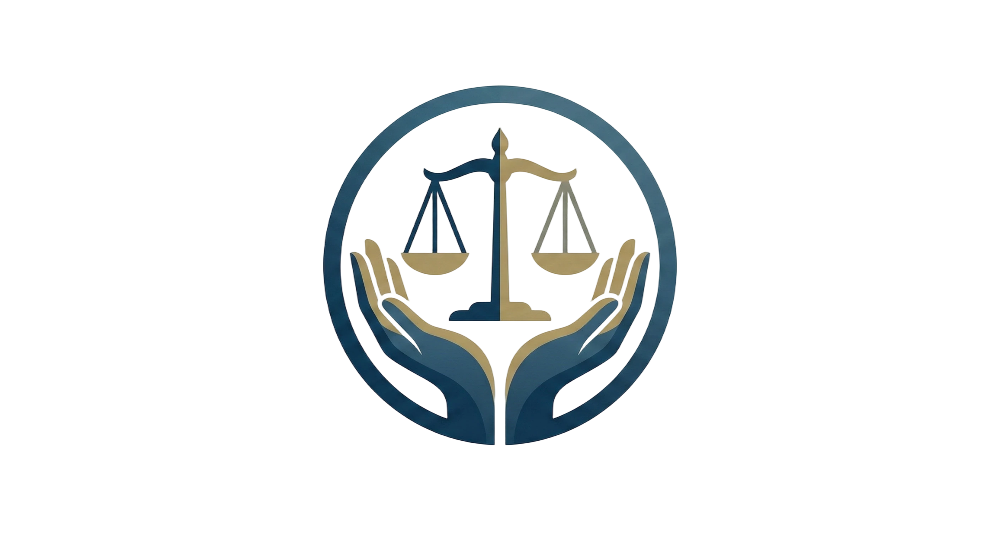
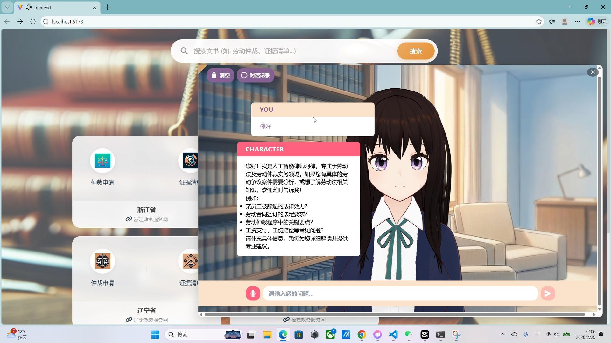

<p align="center">

</p>

<h1 align="center">PartLawyer - Labor Arbitration Assistant</h1>

<p align="center">
<strong>劳动仲裁文书生成辅助平台</strong>
</p>

<p align="center">
<a href="https://github.com/pixiv/ChatVRM"> </a>
<a href="https://github.com/RVC-Boss/GPT-SoVITS"> </a>
<a href="https://unsloth.ai/"> </a>
<a href="https://ollama.com/"> </a>
<a href="https://hub.vroid.com/en/characters/6317386427492305874/models/6271821272125919618"> </a>
<a href="https://www.ai-hobbyist.com/thread-938-1-1.html"> </a>

</p>

## 📖 项目简介
PartLawyer-LAA 是一款专为劳动仲裁设计的辅助平台。系统基于ollama平台接入大模型提供专业法律逻辑支撑，并结合 ChatVRM 3D数字人界面与 GPT-SoVITS 语音克隆技术，为用户提供沉浸式的法律咨询与文书生成服务。

## 📺 演示视频
https://www.bilibili.com/video/BV1TnfhBjEbb/
[](https://www.bilibili.com/video/BV1TnfhBjEbb/)
> 点击上方图片跳转至 B 站观看演示视频

## ☔️ 资源下载
```bash
https://huggingface.co/DerpZhenjun/PartLawyer-LAA/tree/main
所有资源原链接已放入末尾特别鸣谢
```

## 🛠️ 部署流程

#### 1.🐑克隆仓库
```bash
git clone https://github.com/singlerock/Partlawyer-LAA.git
cd Partlawyer-LAA
```

#### 2.🎙️完善 GPT-SoVITS
```bash
将 MingChao-e10.ckpt 放入 GPT-SoVITS\GPT_weights\
将 MingChao_e10_s5220.pth 放入 GPT-SoVITS\SoVITS_weights\
将 chinese-hubert-base 放入 GPT_SoVITS\GPT_SoVITS\pretrained_models\
将 chinese-roberta-wwm-ext-large 放入 GPT_SoVITS\GPT_SoVITS\pretrained_models\
```

#### 3.👤完善 ChatVRM
```bash
在 ChatVRM\src\features\messages\speakCharacter.ts 修改参考音频及其文本内容：
params.append("ref_audio_path", "D:\\...\\zh_vo_zhuiyuejie_second_58_46_F.wav");
params.append("prompt_text", "就像帕斯卡一直想要告诉你真相那样...");
```

#### 4.🤖替换大语言模型（可选）
```bash
ollama run qwen3:1.7b
在backend\llm_service\QA.py下修改：model: str = "ollama/qwen3:1.7b"
在ChatVRM\src\features\chat\openAiChat.ts下修改: const OLLAMA_MODEL = "qwen3:1.7b"
```

## 🚀 启动与运行
#### 🍎Windows下启动项目
```bash
conda create -n LAA python=3.10 -y
conda activate LAA
pip install torch==2.5.1 torchvision==0.20.1 torchaudio==2.5.1 --index-url https://download.pytorch.org/whl/cu121
pip install -r requirements.txt
conda install nodejs=20 -c conda-forge
cd ChatVRM
npm install
cd ..
cd frontend
npm install
cd ..
./start.bat # 启动，第一次提问数字人触发下载模型
```

#### 🍏WSL下微调模型（可选）
```bash
wsl --install -d Ubuntu-22.04
conda activate unsloth
pip install "unsloth[colab-new] @ git+https://github.com/unslothai/unsloth.git"
pip install torch==2.5.1 torchvision==0.20.1 torchaudio==2.5.1 --index-url https://download.pytorch.org/whl/cu121
pip install -r requirements-wsl.txt
修改模型路径与数据集路径：
model_name = "/mnt/d/workspace/PartLawyer/ModelFinetune/model" #修改
dataset_path = "/mnt/d/workspace/PartLawyer/ModelFinetune/dataset/labor_train_dataset.jsonl" #修改
python train.py
```

## ❤️ 特别鸣谢
```bash
https://www.ai-hobbyist.com/thread-938-1-1.html
https://hub.vroid.com/en/characters/6317386427492305874/models/6271821272125919618
https://github.com/pixiv/ChatVRM
https://github.com/RVC-Boss/GPT-SoVITS
https://unsloth.ai/docs
https://docs.ollama.com/modelfile
https://huggingface.co/unsloth/Qwen3-1.7B
https://huggingface.co/datasets/ShengbinYue/DISC-Law-SFT
https://huggingface.co/datasets/Skepsun/lawyer_llama_data
```
