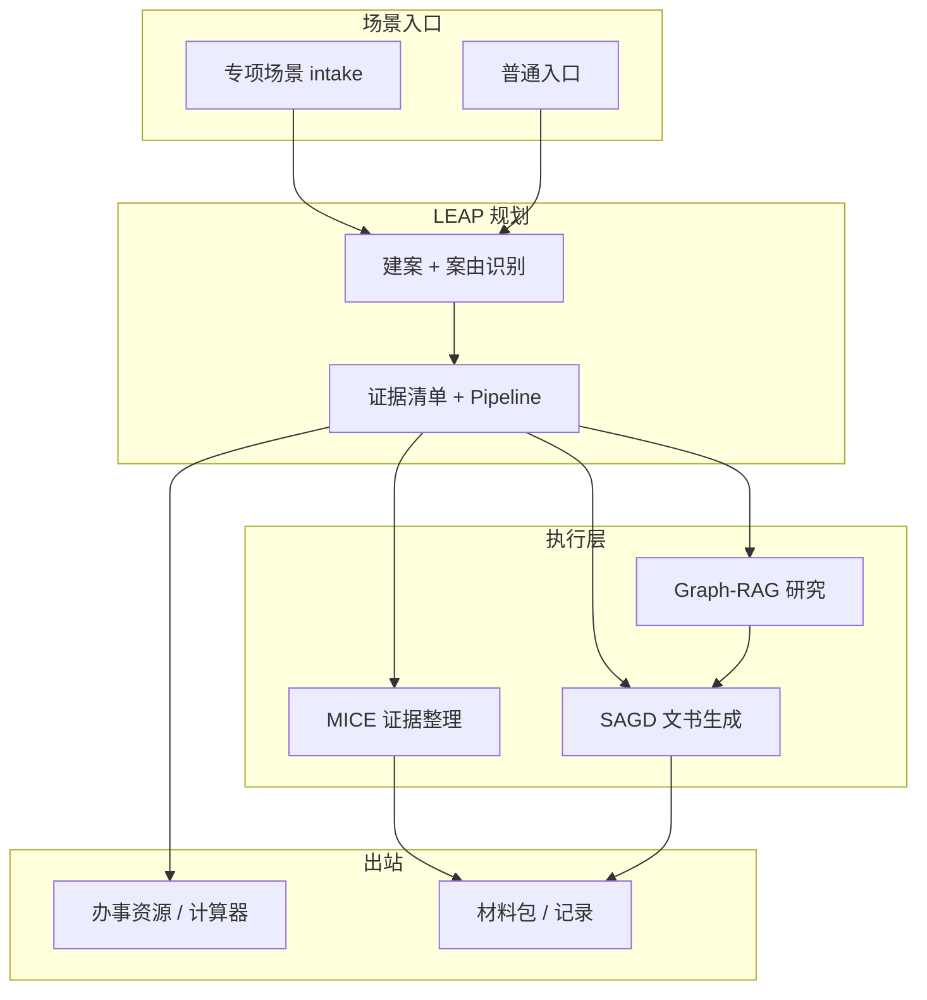

# 劳权智助 LaborAid · 场景驱动智能维权方案稿

> **版本**：v1.0（比赛答辩 / 立项说明）  
> **核心叙事**：不是「一个大模型聊天框」，而是面向劳动者真实维权路径的 **场景化智能服务设计（Scenario-Driven Advocacy Design, SDAD）**  
> **对标优势**：盖诊通等项目的「六层架构 + 关键算法命名 + 实验指标」包装方式，映射到 **劳动争议垂直场景**

---

## 一、一句话定位（答辩开场 30 秒）

**劳权智助（LaborAid）** 是面向劳动者的 **场景化智能维权平台**：以「农民工欠薪、试用期违法解除、女职工特殊保护」等 **高频维权场景** 为入口，通过 **多 Agent 协作流水线**，完成 **建案 → 证据 → 研究 → 文书 → 办事指引 → 材料包导出** 的全流程；底层融合 **多模态 OCR、Graph-RAG 法条增强、结构化文书引擎** 与 **可解释规则质证**，并配套 **法律工具箱**（检索、企业查询、赔偿/时效计算器、合同审查等）形成 **「场景 + 资源 + 工具」三位一体** 的服务体系。

---

## 二、总体思路：为什么强调「场景设计」

| 传统 LegalTech 演示 | LaborAid「场景设计」 |
|--------------------|---------------------|
| 用户自己问 AI | 系统按 **劳动者处境** 预置问题与证据清单 |
| 通用聊天 | **专项 intake**（结构化表单）+ **普通入口**（自由描述） |
| 单点工具 | **场景 → 案件 → Pipeline → 材料包** 闭环 |
| 法条堆砌 | **法条 + 类案 + 官方办事链接** 资源整合 |
| 技术难讲清 | 每个场景对应 **可命名算法模块 + 可演示指标** |

**答辩金句**：

> 我们将劳动争议维权从「用户找工具」重构为 **「场景找用户、系统配路径」**；技术服务于 **可复现的维权场景**，而非脱离业务的模型炫技。

---

## 三、六层体系架构（建议 PPT 主图）

```
┌─────────────────────────────────────────────────────────────┐
│  用户层：劳动者 · 基层援助人员 · 平台管理员                    │
├─────────────────────────────────────────────────────────────┤
│  展现层：服务首页 · 专项/普通 Intake · 证据/文书/报告 · 办事资源 │
├─────────────────────────────────────────────────────────────┤
│  业务层：场景 intake · 智能建案 · 维权 Pipeline · 材料库 · 记录   │
├─────────────────────────────────────────────────────────────┤
│  场景层：农民工欠薪 · 实习生/试用期 · 女职工 · 通用劳动争议       │
├─────────────────────────────────────────────────────────────┤
│  技术层：LEAP · MICE · Graph-RAG · SAGD · Supervisor Agent   │
├─────────────────────────────────────────────────────────────┤
│  数据层：案件库 · 证据/OCR · Chroma 向量库 · 文书/模板 · 外链资源 │
└─────────────────────────────────────────────────────────────┘
```

**与盖诊通对标**：他们用「硬件层=无人机」；我们用 **「场景层=劳动者维权情境」**——更贴题、同样占满一页架构图。

---

## 四、场景矩阵（核心讲解结构）

### 4.1 三大专项场景 + 通用场景

| 场景 ID | 场景名称 | 典型用户故事 | 系统输出 |
|---------|----------|--------------|----------|
| `migrant-worker` | 农民工欠薪 | 包工头/劳务公司拖欠工资，要仲裁 | 欠薪催告函、监察投诉、仲裁申请书、证据清单 |
| `intern-probation` | 实习生/试用期 | 试用期内被辞退，质疑合法性 | 解除通知 OCR、违法解除分析、仲裁请求、赔偿测算 |
| `female-worker` | 女职工特殊保护 | 孕期/产期/哺乳期权益 | 针对性研究、监察/仲裁文书、清单对照 |
| `general` | 普通入口 | 自由描述 + 可选图片 | AI 案由识别 → 动态计划 → 通用 Pipeline |

**每个场景统一五段式（答辩可反复用）**：

1. **情境采集**（结构化表单 / 自然语言 + 图片）  
2. **智能建案**（写入 `case.ai_snapshot.intake`）  
3. **证据就绪**（清单对照 + OCR + 质证提示）  
4. **策略与文书**（研究报告 + 推荐文书 + 生成）  
5. **办事出站**（31 省官方平台 + 12348 + 材料包）

### 4.2 场景演示推荐：case-002 试用期辞退

| 步骤 | 操作 | 讲的技术点 |
|------|------|-----------|
| 1 | 专项 intake 选「试用期」 | 场景驱动表单 → 结构化案情 |
| 2 | 上传解除通知截图 | **MICE**：VL-OCR + 字段抽取 |
| 3 | 查看矛盾/缺项提示 | 规则质证 + 就绪度评分 |
| 4 | 生成研究/report | Graph-RAG + 多源研究引擎 |
| 5 | 批量生成仲裁申请书等 | **SAGD** 结构化文书 |
| 6 | 打开办事资源 / 赔偿计算器 | 资源整合 + 工具箱 |

---

## 五、关键算法与框架（命名版，可上 PPT）

> 原则：**诚实可落地**——基于已有或 1 周内可实现的模块，用学术化命名串联成「算法体系」。

### 5.1 LEAP — Language-Enhanced Advocacy Planning  
**语言增强型维权路径规划**

**功能**：将自然语言/结构化 intake 转为可执行的 **维权 Pipeline 任务图**。

```
输入：场景 ID + 结构化答案 / 自由文本
  → STDE（Structured Task & Dispute Extraction）案情槽位填充
  → 案由匹配 + 证据清单模板（config_loader）
  → Supervisor 评估 5 类 Specialist（Guidance / Evidence / Docgen / Research / Records）
  → 输出：next-step + pipeline_tasks + 路由 prefill
```

**已有代码**：`intake/structured_builder.py`、`agents/supervisor.py`、`orchestrator/pipeline_tasks.py`  
**拓展（建议）**：前端 **Pipeline 流程图** 实时高亮当前阶段。

---

### 5.2 MICE — Multimodal Integrity & Consistency Engine  
**多模态证据一致性质检引擎**

**功能**：图片/PDF → OCR → 结构化字段 → 与案情/清单 **交叉校验**。

| 子模块 | 技术 | 输出 |
|--------|------|------|
| 感知 | 通义 qwen-vl-ocr | OCR 原文 |
| 抽取 | 劳动领域 regex + 词典 NER | 姓名、金额、日期、单位 |
| 校验 | 时间线/金额/主体规则 | ⚠️ 矛盾告警 |
| 对照 | `case_readiness` 清单 | 缺项 + 就绪度分 |

**已有代码**：`pdf_vision.py`、`ocr.py`、`case_readiness.py`、`evidence/chain.py`  
**拓展（建议）**：`GET /cases/{id}/consistency-report` + 证据页「质证提示」卡片。

---

### 5.3 Graph-RAG — 劳动法理图谱增强检索

**功能**：在向量检索（Chroma）之外，用 **「法条—情形—文书—证据」** 小图谱做可解释推荐。

```
案由/场景 → 图谱邻居扩展 → 推荐法条 + 文书类型 + 必备证据
           ↘ 向量精排 ↗ 合并送入研究/文书生成
```

**已有代码**：`vector/store.py`、`search/unified.py`、`docgen/recommendations.py`  
**拓展（建议）**：`resources/legal-graph/labor-disputes.json`（30～50 三元组）+ 前端关系图一页。

---

### 5.4 SAGD — Structured Agentic Document Generation  
**结构化 Agent 文书生成**

**功能**：**模板约束 + LLM 增强 + 法条引用校验** 的混合生成，保证法院/仲裁格式。

```
案情 + parsed_case + Graph-RAG/研究结果
  → enrich_structured_payload（字段补全）
  → renderers（劳动仲裁申请书等 17+ 类型）
  → 可选 LLM 增强 → sanitize → Word 导出
```

**已有代码**：`docgen/structured/`、`generate_service.py`、`word_export.py`  
**拓展（建议）**：法条引用与知识库 **字符串对齐校验** + 报告页展示「引用置信度」。

---

### 5.5 Supervisor-Worker 多 Agent 编排

| Agent | 职责 | 对应工具 |
|-------|------|----------|
| GuidanceAgent | 办事资源、外链 | `/guidance` |
| EvidenceAgent | 上传、OCR、证据链 | `/evidence` |
| DocgenAgent | 文书推荐与生成 | `/documents` |
| ResearchAgent | 深度研究报告 | `/research` |
| RecordsAgent | 记录与材料包 | `/records`、`/vault` |

**已有代码**：`services/agents/specialists/*`  
**拓展（建议）**：案件详情页 **Agent 拓扑图** + handoff 说明（不必强上 LangGraph）。

---

## 六、法律资源整合（单独一章讲，显「资源厚度」）

### 6.1 三层资源模型

| 层级 | 内容 | 产品形态 |
|------|------|----------|
| **权威外链** | 12348、仲裁委、法援、国家法规数据库 | `/guidance` + 31 省 `official-platforms.json` |
| **站内智能检索** | 法条/案例向量库 + AI 摘要 | `/search`、研究引擎引用 |
| **案件级绑定** | intake 快照、证据 OCR、生成文书 | 案件 `ai_snapshot`、材料库导出 |

### 6.2 资源整合话术

> **「三源融合」**：官方办事资源（可信出站）+ 本地向量知识库（可检索）+ 大模型 synthesis（可读写）——解决劳动者 **「去哪办、查什么、写什么」** 三件事。

### 6.3 拓展建议

- **法条变更提示**（静态配置即可）：如《劳动合同法》第 39/40/41 条与试用期场景绑定说明  
- **类案摘要卡片**：检索结果展示「与本案相似点」3 条（LLM 或模板）  
- **材料包一键导出**：文书 + 证据清单 + OCR 文本 + 研究报告 PDF（已有部分能力，答辩强调「一站式」）

---

## 七、法律工具箱（「其他工具」统一包装）

不要分散讲「还有一个计算器」，建议包装为 **「维权工具矩阵」**：

| 工具 | 路由 | 场景关联 | 技术关键词 |
|------|------|----------|------------|
| 案件管理 | `/cases` | 所有场景中枢 | 案件上下文、就绪度 |
| 整理证据 | `/evidence` | 证据场景核心 | MICE、OCR |
| 生成文书 | `/documents` | 文书场景核心 | SAGD |
| 分析案情 | `/research` | 策略场景 | 多源研究引擎 |
| 检索法规 | `/search` | 全场景 | RAG、Graph-RAG |
| 审查合同 | `/contracts` | 入职/解除前 | 风险维度 LLM 审查 |
| 查询企业 | `/enterprise` | 欠薪/认定用人单位 | 企查查 API 融合 |
| 时效计算 | `/tools/limitation` | 仲裁前置 | 规则引擎 |
| 赔偿计算 | `/tools/compensation` | 解除/欠薪 | 公式 + 参数解释 |
| 我的材料 | `/vault` | 归档闭环 | 文档归档流水线 |
| 办事资源 | `/guidance` | 出站闭环 | 省级平台配置 |

**讲解顺序**：先 **场景 Pipeline 主路径**，再 **「工具箱 = 场景内嵌 + 随时可唤起的能力模块」**。

---

## 八、智能维权主流程（答辩流程图）

> **图源（可编辑/导出 PNG）**：[`docs/diagrams/`](../diagrams/README.md)  
> Cursor Skill：`.cursor/skills/laboraid-architecture-diagrams/`  
> 导出命令：仓库根目录 `.\scripts\export-diagrams.ps1`



---

## 九、实验与指标（仿「消融实验 + 横向对比」页）

在 **case-001 欠薪 / case-002 试用期** 上测，答辩用 **真实数字**（需实施 MICE 拓展后填写）：

| 指标 | 含义 | 目标叙事 |
|------|------|----------|
| 证据清单覆盖率 | 上传证据 vs intake 清单 | 场景设计提升 **X%** |
| OCR 字段准确率 | 金额/日期/单位抽取 | MICE 抽取 **F1 ≥ 0.85**（小样本） |
| 矛盾检出率 | 人工植入 5 处矛盾 | 规则引擎检出 **≥4/5** |
| 文书字段完整度 | [待填写] 占比下降 | SAGD vs 纯 LLM **提升 Y%** |
| 法条引用可核对率 | 引用是否在库中 | Graph-RAG **≥ Z%** |
| 端到端耗时 | intake → 首份文书 | **< N 分钟**（demo 实测） |

**消融实验设计**（柱状图一页）：

- 完整 LaborAid  
- 去掉 Graph-RAG（仅向量）  
- 去掉 MICE 规则（仅 OCR 文本）  
- 去掉结构化 SAGD（纯 LLM 文书）  

---

## 十、功能拓展路线图（按比赛性价比排序）

### P0 — 答辩前必做（1 周）

| 项 | 工作量 | 答辩价值 |
|----|--------|----------|
| MICE 矛盾/缺项报告 API + 证据页 UI | 2～3 天 | ⭐⭐⭐⭐⭐ live demo |
| 案件 Pipeline / Agent 流程图（前端） | 1 天 | ⭐⭐⭐⭐ 对标 LECP 任务图 |
| 场景总览一页（三专项 + 流程） | 0.5 天 | ⭐⭐⭐⭐ 场景设计核心 |
| case-002 固定演示脚本 | 0.5 天 | ⭐⭐⭐⭐⭐ |
| 小样本指标测试 + 消融柱状图 | 1～2 天 | ⭐⭐⭐⭐⭐ 对标 94.66% 页 |

### P1 — 有时间再做

| 项 | 说明 |
|----|------|
| Graph-RAG 小图谱可视化 | 5～8 个情形节点即可 |
| 场景化「维权报告」一键 PDF | 研究 + 就绪度 + 清单 + 建议 |
| 赔偿计算器与案情联动 | 从 OCR 金额预填 |
| 语音案情简述 | 产品架构已预留，可作「拓展展望」 |

### P2 — 写在「未来工作」

- 移动端扫码拍证据  
- 与地方仲裁立案系统对接  
- 小样本 LoRA 微调劳动 NER（**仅展望，勿声称已做**）

---

## 十一、答辩 PPT 建议目录（12 页）

1. **痛点与场景**：劳动者维权材料散、程序不懂、法条找不到  
2. **场景设计总览**：三专项 + 普通入口 + 五段式闭环  
3. **六层架构图**（第三节）  
4. **关键算法一 LEAP**：自然语言 → 维权任务图  
5. **关键算法二 MICE**：OCR → 抽取 → 质证  
6. **关键算法三 Graph-RAG + 三源资源整合**  
7. **关键算法四 SAGD + Supervisor 多 Agent**  
8. **法律工具箱矩阵**（第七节表格）  
9. **实验结果**：消融 + 对比 + 指标表  
10. **系统演示**：case-002 截图/录屏  
11. **创新点与社会价值**  
12. **总结与展望**

---

## 十二、与盖诊通的话术对照（评委问「你们技术在哪」）

| 评委可能问 | 推荐答法 |
|-----------|----------|
| 你们有没有 AI 算法？ | 有 **LEAP 路径规划、MICE 多模态质证、Graph-RAG、SAGD**，面向劳动争议场景设计，不是通用聊天 |
| 有没有计算机视觉？ | **VL-OCR 感知 + 劳动领域字段抽取 + 扫描 PDF 分页识别**，服务证据场景 |
| 有没有融合？ | **场景 + 多 Agent + 法条图谱 + 向量 RAG + 规则引擎** 五层融合 |
| 有没有实验数据？ | case-001/002 测试集上的 **覆盖率、F1、消融对比**（展示图表） |
| 和 ChatGPT 有什么区别？ | **场景 intake、证据清单、Pipeline、结构化文书、官方办事出站** 全闭环 |

---

## 十三、团队内部分工建议

| 角色 | 任务 |
|------|------|
| 产品/答辩 | PPT 12 页 + case-002 演示脚本 + 场景故事 |
| 后端 | MICE API、Graph 配置、指标脚本 |
| 前端 | Pipeline 图、质证卡片、场景总览 |
| 测试 | 10～20 条标注样本测 F1 / 检出率 |

---

## 十四、总结

**LaborAid 的高级感不来自「再训一个 YOLO」**，而来自：

1. **场景设计** — 把劳动者处境产品化（专项 intake + 清单 + Pipeline）  
2. **Named Pipeline** — LEAP / MICE / Graph-RAG / SAGD 可讲、可画、可测  
3. **资源 + 工具矩阵** — 法条、外链、计算器、企业查询统一纳入「维权工具箱」  
4. **可演示闭环** — case-002 一条线打穿，对标盖诊通「任务图 + 指标页」

---

*文档维护：比赛前根据实际实现的指标更新第九节数字；代码实现优先级以第十节 P0 为准。*
