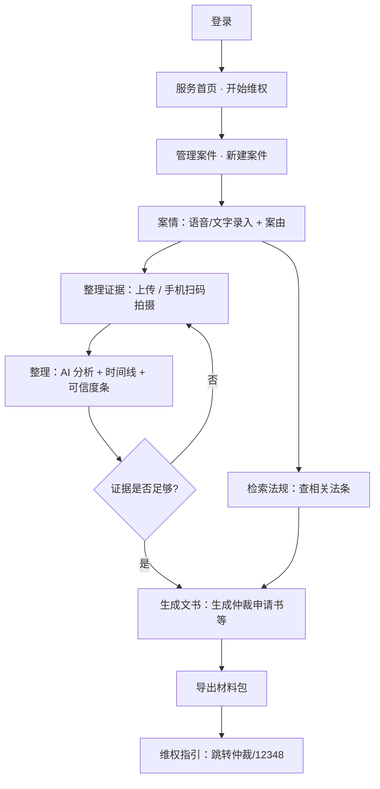

# 劳权智助 · LaborAid 产品架构设计方案

> **版本**：v1.0（设计稿，尚未全面落地）  
> **定位**：劳动者维权自助 **服务平台** + 完整 **法律工具箱**  
> **原则**：保留登录与历史；保留查法、文书等原有能力；不做社区发帖与管理员端

---

## 1. 产品定位

### 1.1 一句话

**LaborAid — 帮劳动者整理维权材料与证据，并提供权威官方办事指路。**

### 1.2 双层次结构

| 层次 | 用户感知 | 职责 |
|------|----------|------|
| **服务层** | 服务大厅 | 维权入口、权威外链、我的记录、推荐办事路径 |
| **工具层** | 法律工具箱 | 检索法规查法、生成文书生成文书、整理证据、分析案情、管理案件等 **原有能力全部保留** |

### 1.3 与 slogan 的关系

- 品牌：`劳权智助 · LaborAid` — *让劳动者维权更省心*
- 垂直聚焦：**劳动者维权**（政策与需求契合，但不排斥其他工具使用）
- 推荐对外副标题（实施时可写入 `brand.ts`）：**劳动者维权自助服务平台**

---

## 2. 设计边界

### 2.1 做什么

- 用户注册 / 登录（已有）
- 站内 AI 法律工具：检索、文书、证据、研究、案件管理等
- 劳动者维权 **推荐路径**（非唯一路径）
- 四大创新：语音案情、手机扫码拍摄、证据时间线、AI 可信度条
- 材料包导出（文书 + 证据清单 + 附件）
- **维权指引**：跳转 12348、仲裁、法援、国家法律法规数据库等 **权威平台**
- **我的记录**：案件、文书、研究报告、最近使用工具等历史聚合

### 2.2 不做什么（v1 明确排除）

| 不做 | 原因 |
|------|------|
| 社区发帖 / 评论 / 互助论坛 | 降低 UGC 合规与审核成本 |
| 管理员后台 | v1 不设计；违规或运维需求后期再议 |
| 站内律师撮合 / 付费咨询 | 责任边界复杂，改为外链律协 / 12348 |
| 替代仲裁委立案系统 | 仅辅助整理材料 + 外链办事 |
| 自建权威法规库 | 原文核对跳转 **国家法律法规数据库** |

### 2.3 免责声明（全站需可见）

- AI 输出与站内检索结果为 **辅助整理**，不构成法律意见或代理行为
- 外链内容以 **发布机关官网** 为准
- 涉及金额、时效、胜诉判断等须 **人工或官方渠道复核**

---

## 3. 用户端信息架构

```
登录 / 注册
    │
    ▼
┌─────────────────────────────────────────────────────────┐
│  服务首页                                                │
│  · 开始维权（推荐路径）                                   │
│  · 权威服务入口（12348 / 仲裁 / 法援 / 法规库）          │
│  · 法律工具箱入口（检索法规、生成文书、整理证据…）                    │
│  · 最近使用 / 快捷继续                                    │
└─────────────────────────────────────────────────────────┘
    │
    ├──► 我的记录（历史聚合）
    ├──► 维权指引（按案由推荐外链与步骤）
    └──► 法律工具箱（原有各模块，路由不变）
              │
              检索法规 | 生成文书 | 整理证据 | 审查合同 | 分析案情 | 法律知识库 | 管理案件 | 模板 | 设置
```

---

## 4. 页面与路由规划

### 4.1 服务层页面

| 页面 | 路由建议 | 说明 |
|------|----------|------|
| 服务首页 | `/` | 改造现有 Dashboard/门户，劳权导向 + 工具入口 + 权威卡片 |
| 我的记录 | `/records` | 新建；Tab：案件 / 文书 / 研究 / 最近工具 |
| 维权指引 | `/guidance` | 新建；案由选择 + 官方步骤 + 外链 |

### 4.2 工具层页面（保留，不改路径）

| 模块 | 路由 | 能力 |
|------|------|------|
| 检索法规 | `/search` | 法规 / 案例 / 混合检索 + AI 摘要 |
| 生成文书 | `/documents` | AI 生成法律文书，导出 Word 等 |
| 整理证据 | `/evidence` | 证据上传、OCR、分析、质证（+ 创新功能） |
| 审查合同 | `/contracts` | 合同审查（含劳动合同场景） |
| 分析案情 | `/research` | 深度法律研究报告 |
| 法律知识库 | `/knowledge` | 个人知识库 |
| 管理案件 | `/cases` | 案件管理，关联文书与证据 |
| 文书模板 | `/templates` | 文书模板 CRUD |
| 设置 | `/settings` | LLM 与系统配置 |

### 4.3 导航建议

侧边栏分组（改造 `Layout` / `agents.ts` 展示逻辑，**不删除模块**）：

1. **服务**：首页、我的记录、维权指引  
2. **维权工具**：管理案件、整理证据、生成文书、审查合同  
3. **研究工具**：检索法规、分析案情、法律知识库  
4. **系统**：文书模板、设置  

---

## 5. 站内工具 vs 权威外链

| 场景 | 用站内 | 用外链 |
|------|--------|--------|
| 快速理解法条、生成文书前检索 | **检索法规 / 分析案情** | — |
| 法条原文核对 | 可先站内 | **国家法律法规数据库** |
| 整理案情、证据、时间线 | **管理案件 / 整理证据** | — |
| 生成仲裁申请书、证据清单 | **生成文书** | — |
| 立案、投诉、申请法援 | — | **仲裁委 / 人社 / 法援 / 12348** |
| 找执业律师 | — | **律协官网查询**（仅链接，不做站内池） |

**原则**：站内负责 **准备**；外链负责 **权威与办事**。

---

## 6. 推荐用户旅程（劳动者维权）

以下为 **推荐路径**，用户仍可从导航直接进入任意工具。



---

## 7. 四大创新（v1 必做项）

### 7.1 语音说案情

| 项 | 说明 |
|----|------|
| 入口 | 管理案件（新建/编辑案件）、生成文书（案件事实字段） |
| 技术 | Web Speech API 为主；可选录音 + Whisper |
| 输出 | 转写文本 → 可选 LLM 抽取：入职/离职、案由、主张金额等 |

### 7.2 手机扫码现场拍摄

| 项 | 说明 |
|----|------|
| 入口 | 整理证据页「手机拍摄」按钮 |
| 流程 | PC 生成 QR + 短期 token → 手机 H5 `/m/capture/:token` → 拍照上传至指定案件 |
| 增强 | 可选水印：时间、案件编号 |
| 说明 | 非 PC 远程调起手机摄像头，为用户 **扫码后在手机浏览器** 授权拍摄 |

### 7.3 证据时间线

| 项 | 说明 |
|----|------|
| 入口 | 整理证据或管理案件内「时间线」Tab |
| 输入 | 各证据 OCR 文本 + 已有 analysis |
| 输出 | `[{ date, event, evidence_id, confidence }]` 按时间排序展示 |
| 劳权节点示例 | 入职、签合同、调岗、欠薪、解除、知道权利受损 |

### 7.4 AI 可信度条

| 项 | 说明 |
|----|------|
| 展示 | 每段 AI 分析（证据分析、分析案情、证据链报告等）下方 |
| 指标 | 是否引用法条；证据是否齐全（对照案由 checklist）；是否建议人工复核 |
| 数据 | LLM 结构化 JSON 字段 `credibility`，见 §9.3 |

### 7.5 材料包导出（闭环）

| 项 | 说明 |
|----|------|
| 入口 | 管理案件详情或生成文书完成页 |
| 内容 | 已生成文书 + 证据清单 + 用户上传文件（ZIP） |
| 可选 | 单文件 SHA256 指纹展示（轻量存证叙事） |

---

## 8. 我的记录（历史）

### 8.1 聚合内容

| Tab | 数据来源 | 操作 |
|-----|----------|------|
| 案件 | `GET /cases` | 进入管理案件详情 |
| 文书 | `GET /documents` | 进入生成文书详情 / 再导出 |
| 研究报告 | `GET /research` | 进入分析案情详情 |
| 最近使用 | `localStorage` `LaborAid_recent_agents` | 跳转对应工具 |

可选扩展：检索法规检索历史（已有 `storage-keys` 本地记录）并入「最近检索」子 Tab。

### 8.2 与登录关系

- 所有案件、文书、报告按 **用户 owner_id** 隔离（现有模型已支持）
- 未登录用户仅可使用登录页，历史不可见

---

## 9. 维权指引（权威外链）

### 9.1 实现方式

- **静态配置**：`frontend/src/config/labor/guidance.json`（或前后端共享 JSON）
- **无需爬虫、无需政务 API**；链接需定期人工核对

### 9.2 全局权威入口（常驻）

| 名称 | 用途 |
|------|------|
| 12348 法律服务热线 | 电话咨询指引 |
| 中国人社 / 劳动保障监察 | 欠薪投诉等 |
| 劳动人事争议调解仲裁 | 仲裁程序（国家级入口 + 文案提示查当地） |
| 中国法律服务网 | 法律援助 |
| 国家法律法规数据库 | 法条原文 |

### 9.3 案由场景化推荐（示例结构）

```json
{
  "cause_id": "wage_arrears",
  "cause_label": "拖欠工资",
  "official_steps": [
    {
      "title": "向劳动保障监察投诉",
      "when": "用人单位仍存在、欠薪事实较清楚",
      "url": "https://...",
      "note": "各地入口可能不同，以当地人社部门为准"
    },
    {
      "title": "申请劳动仲裁",
      "when": "监察无法解决或需确认劳动关系",
      "url": "https://..."
    }
  ],
  "hotlines": [{ "name": "12348", "tel": "12348" }],
  "lawyer_hint": "可通过省级律师协会官网查询执业律师"
}
```

### 9.4 案由枚举（v1 建议 4 类）

1. `wage_arrears` — 拖欠工资  
2. `illegal_termination` — 违法解除劳动合同  
3. `overtime_pay` — 加班费  
4. `no_written_contract` — 未签订书面劳动合同  

每类配 **建议证据清单**（供可信度条比对），见 `evidence-checklist.json`。

---

## 10. 技术架构（简述）

### 10.1 逻辑分层

```
展示层     React 页面（服务首页 / 记录 / 指引 / 原有工具页）
应用层     FastAPI routers 编排用例
能力层     LLM（llm_resolver）、OCR、导出、timeline/credibility 服务
数据层     SQLite + 文件存储 + ChromaDB（向量）
配置层     labor/*.json、brand、agents、.env
```

### 10.2 后端模块（沿用 + 增量）

| 已有 | v1 增量 |
|------|---------|
| auth, cases, evidence, documents, search, research, contracts, knowledge, templates, llm_settings | `timeline` 分析接口或合入 evidence analyze |
| | `capture-session` 扫码拍摄 token |
| | `cases/{id}/bundle` 材料包 ZIP |
| | analyze 响应增加 `credibility` 字段 |

**不新增**：`community`、`admin` 路由。

### 10.3 AI 统一响应契约（建议）

分析类接口尽量返回：

```json
{
  "content": "Markdown 正文",
  "credibility": {
    "law_citations": [{ "name": "劳动合同法", "article": "47", "verified": false }],
    "evidence_coverage": { "required": 7, "matched": 5, "missing": ["工资银行流水"] },
    "needs_human_review": ["经济补偿基数"],
    "overall_level": "medium"
  },
  "timeline_events": [
    { "date": "2024-03-01", "event": "入职", "evidence_id": 12, "confidence": 0.85 }
  ]
}
```

一次 LLM 调用可同时支撑 **正文 + 可信度条 + 时间线**。

### 10.4 前端目录（渐进式）

现有结构保留；新增建议：

```
frontend/src/
├── config/labor/
│   ├── guidance.json          # 维权指引
│   ├── causes.json            # 案由枚举
│   └── evidence-checklist.json
├── pages/
│   ├── Dashboard.tsx          # 改造为服务首页
│   ├── Records.tsx            # 我的记录
│   ├── Guidance.tsx           # 维权指引
│   └── MobileCapture.tsx      # 手机拍摄 H5
├── components/
│   ├── CredibilityBar.tsx
│   ├── EvidenceTimeline.tsx
│   ├── VoiceInput.tsx
│   └── MobileCaptureQR.tsx
└── ... 原有 pages 保留
```

---

## 11. 数据模型（增量字段建议）

在不大改表的前提下，优先 JSON 字段；稳定后再拆表。

| 实体 | 增量字段 |
|------|----------|
| Case | `cause_type`, `stage`, `voice_transcript`, `case_summary` |
| Evidence | `file_hash`, `credibility` (JSON), `capture_meta` (JSON) |
| Case（或独立表） | `timeline_json` — 时间线事件数组 |

---

## 12. 实施分期

| 阶段 | 目标 | 交付物 |
|------|------|--------|
| **P0** | 设计落地文档 | 本文档 + `config/labor/*.json` 样例 |
| **P1** | 服务壳子 | 首页改造、导航分组、维权指引页、我的记录页 |
| **P2** | 创新 ①② | 语音输入、扫码拍摄 H5 |
| **P3** | 创新 ③④ | 时间线 UI、可信度条组件 + 后端 JSON |
| **P4** | 闭环 | 材料包 ZIP、案由 checklist 联动可信度 |
| **P5** | 文档与演示 | README、用户旅程 demo 脚本 |

**明确不在 P1–P5**：社区、管理员、政务 API、律师入驻。

---

## 13. 成功标准（Demo / 答辩）

1. 用户登录后能在 **服务首页** 看到劳权导向与权威入口  
2. 能使用 **检索法规查法、生成文书生成文书** 等原有功能  
3. 能在 **管理案件 + 整理证据** 完成：语音案情 → 扫码拍摄 → 时间线 → 可信度条  
4. 能 **导出材料包** 并通过 **维权指引** 跳转官方链接  
5. **我的记录** 可查看历史案件与文书  

---

## 14. 相关文档

- [API 配置位置](./api-config-locations.md)
- [模型配置](./model-config-guide.md)
- [文件上传与多模态](./file-upload-guide.md)
- 智能体注册表：`frontend/src/config/agents.ts`

---

## 15. 修订记录

| 版本 | 日期 | 说明 |
|------|------|------|
| v1.0 | 2026-05 | 初稿：服务平台 + 全工具保留 + 四创新 + 无社区/无 admin |
